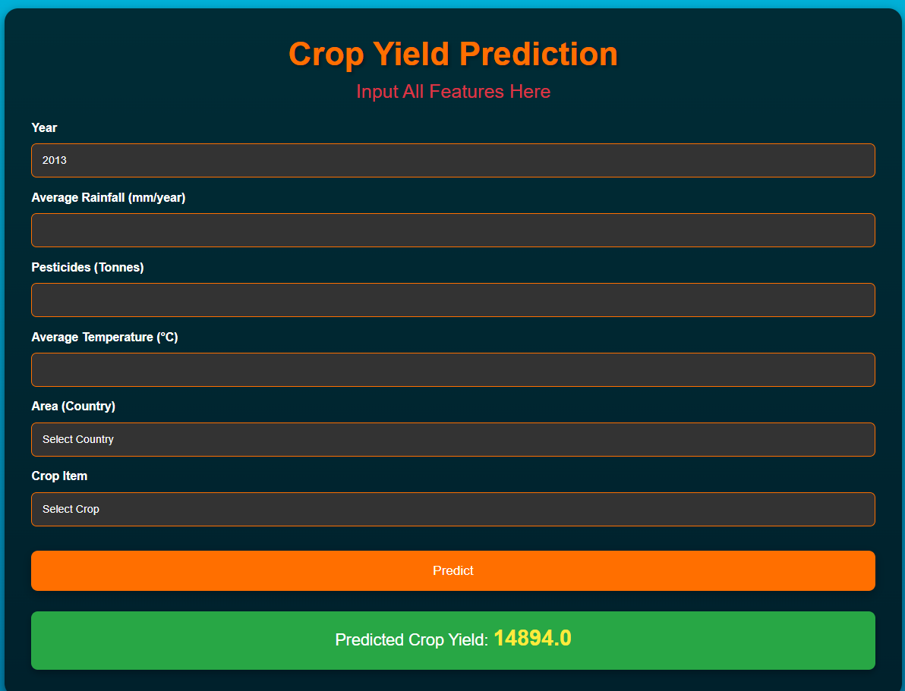

# 🌾 Crop Yield Prediction Using Machine Learning

This project predicts crop yield based on various environmental and soil parameters using **Machine Learning** models.

## 🚀 Features
- **Data Preprocessing:** Handles missing values, feature scaling, and encoding.
- **Machine Learning Models:** Implements Decision Tree, Random Forest, etc.
- **Model Persistence:** Saves trained models using `pickle`.
- **Web App (Optional):** Can be deployed using Flask.

**Clone the Repository**  
  
   git clone https://github.com/satyam16000/Crop-Yield-Prediction.git
   cd Crop-Yield-Prediction

pip install -r requirements.txt
python app.py
